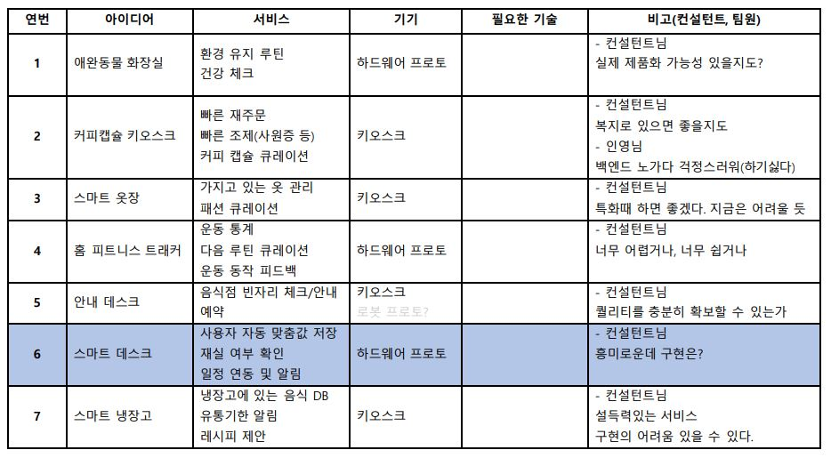

## IoT 아이디어 기획

### 1. 애완물 자동 배변처리핵심 기능

- - 고양이(강아지) 배변 처리 기능
  - 배변 장소 환경 유지
  - 배변물로 건강 체크
- who's target?
  - 고양이 집사
- 구현
- 컨설턴트님 한마디
  - 제품화 가능하기만 하다면 좋다. 가능할 것 같은데.

### 2. 커피캡슐 추천 키오스크

- 핵심 기능

  - 커피 추천 서비스
  - 커피 재주문 서비스
  - 유저별로 커피 소비 데이터 수집하여 추천 서비스 등 활용
    - 아이디? 사원증?
  - 라떼 제조도 지원?
  - 키오스크에 사원증 체크 -> 바로 자동 조제
  - 탕비실 각

- who's target?

  - 캡슐머신 사용자
  - 집 or 공용장소?
    - 회사? 사원들의 소비 데이터를 사용하면 보다 효율적으로 커피 구매할 수 있음.
  - 구체적인 머신(네스프레소/일리?)

- 구현

- 컨설턴트님 한마디

  - 굿. 사원 복지 연계해서 발전 가능함. 

  
### 3. 스마트 옷장

- 핵심 기능

  - 의류 구매 후 등록 기능 (비젼 센서 or 직접 등록 가능)
  - 등록된 데이터 기반으로 옷 매칭 추천 서비스 (날씨? 계절? 색감 기반?)

- 타겟 유저

  - 어떤 옷을 샀는지 파악하는 데 어려움을 느끼는 유저
  - 의상 추천받고 싶은 유저

- 구현

  

- 컨설턴트님 advice

  - 에어드레서와 연계
  - 특화 프로젝트 때 하면 더 좋을 듯. 구현이 빡셀 것 같음. 
  - AI로 의류 판별하는 게 쉽지 않을 것. 
  - 보여주기식 포트폴리오로 만들기는 가능할 것 같은데? 흠...

### 4. 홈 피트니스 트래커

- 핵심 기능

  - 운동 회수(자이로 센서) / 개수 카운트 (소리로 카운트)

  - 운동 사이클 추천 (쉬웠는지 어려웠는지 피드백, 데이터 분석하여 다음 운동 루틴 추천)
  - 무게 중심 등을 감지해서 운동 동작이 잘 이뤄지는지 등을 판단해줌

- 타겟 유저

  - 코로나 이후 홈트하지만 적절한 피드백을 얻지 못하는 것에 아쉬움을 느끼는 유저

- 구현

- 컨설턴트님 advice

  - 엄청 많았음
  - 웹보다는 앱
  - 이미 너무 잘 만들어진 인터페이스가 있다
  - 잘만들어진 툴을 사용하면 구현할 게 별로 없을 것이다
  - 또 이거냐?

### 5. 안내 데스크

- 핵심 기능
  - 음식점 예약 / 빈자리 체크 / 빈자리 안내
- 타겟 유저
  - 식당 이용자, 먹자골목, 전통시장, 마트, 식당가 등(식당이 집합되어 있는 곳과, 그 곳을 이용하는 이용자)
- 구현

- 컨설턴트님 advice
  - 진짜 쓰일 만한 퀄리티로 만들 수 있는가? 아니라면 보여주기가 될 수 있음.

### 6. 스마트 데스크 (매우 흥미로움)

- 핵심 기능

  - 유저별 환경 설정 저장 및 자동으로 세팅
  - 메신저 아이디 연동하고 디스플레이로 사용자 표시/메시지 띄워주기?
  - 재실 여부 확인?

- 타겟 유저

  - 거점 오피스를 사용하는 회사가 최우선 타겟

  - 회사? 개인 유저?

- 구현

  - 컨설턴트님 advice
    - 진짜 있으면 좋을 거 같은데. 흥미롭다.
    - 근데 어떻게 기계를 구현할 것?
    - Q. 미니어쳐로 제작하는 방향은 가능한가?
      A. 설득력 떨어질 것 같은데.. 

### 7. 스마트 냉장고

- 핵심 기능

  - 냉장고 안에 어떤 음식있는지 DB 저장 (및 요리 추천?)
    - 식재료 종류별로 구분 (소스류 / 김치류 / 고기류 ...)

  - 유통기한 체크 및 알림 (유통기한이 얼마 남았다, 유통기한이 지났다, )
  - 냄새 센서..?

- 타겟 유저

  - 냉장고 관리에 어려움을 느끼는 사람들

- 구현

- 컨설턴트님 advice
  - 많이 나왔는데 실제 사용할만한 서비스를 구현하는 데 어려운 지점이 많았음.
    - 생각보다 불편함 / 음식 판별이 잘 안 됨 
    - 편리한 유저 경험을 제공할 수 있는가? 예를 들어 바코드 찍는 수준으로 편하게 등록하도록.

### Table로 보기

### 아이디어 선택

경민 :  스마트 데스크 / 스마트 냉장고 / 펫 배변처리기 / 커피머신 키오스크 / 스마트 옷장

용욱 : 커피 머신 키오스크 / 스마트 옷장 / 데스크는 남이 만들어주면 ㅎㅎ / 펫 배변처리기

윤호 : 치매 환자_아동 위치추적 / 카드 하나로 적립 및 할인 / 음식 주문 키오스크 / 스마트데스크, 냉장고 / 스마트 옷장 / 게임

인영 :  펫 배변처리기 / 데스크

희재 : 펫 배변처리기 / 커피 머신 키오스크 / 스마트 옷장

### 고려해야 할 사항

- 프로젝트의 목적성이 무엇인가? 

  - 임베디드 구현 경험? 실제 유저를 모아보는 경험?

- 가구를 할 거면 smart things 참고

