<center>  </center>

# <center> 🔩 DDOKDI : 모션 데스크 자동 세팅 서비스 </center>

## DDOKDI 키오스크 화면
## > https://i7a102.p.ssafy.io/

<br>

## 소개 영상
<br>

## 프로젝트 진행 기간
> 2022/07/05(화)~2022/08/19(금) -- 7주 \
> SSAFY 7기 공통 프로젝트 \
> A102 팀
<br>

## 📈 DDOKDI 배경
  코로나 19  이후 거점 오피스를 이용하거나 자율 좌석제를 시행하는 회사가 늘어나고 있습니다. 
  회사가 고정된 자리를 의미하던 이전과는 달리 이제 내가 일을 하는 곳이 곧 회사가 된 것인데요. 

  거점 오피스는 자율 좌석제가 비교적 편리한 공간에서 일할 수 있다는 장점을 갖고 있지만 이는 곧 자신만의 자리가 없다는 말과도 같기 때문에 
  출근할 때마다 자리를 나에 맞춰서 세팅을 해줘야 한다는 이전에 없던 새로운 불편함이 생겨났습니다.

  나만의 똑똑한 데스크, 똑디는 데스크 세팅을 로그인이나 사원증 태그 한 번으로 유저가 미리 설정한 세팅으로 바꾸어줍니다. 
  또한 회사에서 오늘 할 일을 기록하고 일정 시간 이전에 알림을 띄워주는 캘린더 기능으로 
  팀원 간 서로 떨어져 일하는 게 일상화되는 요즘의 근무 환경에서 중요한 일정을 잊지 않도록 도와줍니다. 
  이렇게 똑디는 유저가 어느 자리에서든 자신의 자리처럼 똑똑하게 일할 수 있도록 도와줍니다.

<br>

## 💻 DDOKDI는..
DDOKDI는 사용자에게 맞는 책상, 모니터 높이를 설정하고 저장하여 어디서든 자신만의 업무 환경을 구축하는 서비스를 제공합니다.
거점 오피스와 같이 매일 자리가 바뀌는 환경에서 DDOKDI는 사용자가 매일 일정한 업무 환경을 구축할 수 있게 해줍니다.
좌석 조회 기능을 통해 각 자리를 사용하는 사용자의 상태를 조회할 수 있습니다.
좌석 관리 기능을 통해 좌석 구성을 자유롭게 변경할 수 있도록 해줍니다.

<br>

## 🔗 주요 기능
### 1. 자동 세팅 및 세팅 정보 관리
   - 키오스크에서 좌석을 배정받으면 해당 좌석을 당신의 기본 설정으로 자동 세팅해줍니다.
   - 1cm 단위로 책상과 모니터 높이 조절하여 자신에 딱 맞는 설정을 정해보세요.
   - 마음에 드는 세팅 정보를 저장하고 새로운 자리에 앉았을때 불러오기할 수 있습니다.

### 2. 캘린더
   - 업무 일정을 추가하면 중요도에 따라 색을 달리 표시하여 체계적으로 업무를 관리할 수 있습니다.
   - 설정한 알람시간에 맞춰 알람을 울려줍니다.
   - 업무 목적별로 다양하게 캘린더를 구성할 수 있습니다.

### 3. 좌석 조회
   - 자신의 현재 상태를 설정할 수 있습니다.
   - 좌석 조회 화면에서 각 자리의 사용자 정보와 상태를 확인할 수 있습니다.

### 4. 좌석 관리
   - 적용하고 싶은 사무실 구조에 맞게 좌석을 배치할 수 있습니다.
   - 좌석의 추가, 삭제, 이동, 회전 기능을 제공하여 자유롭게 좌석 구성을 관리할 수 있습니다.

<br>

# 🔨 주요 기술

## BackEnd
- IntelliJ IDE 21.3.3
- Springboot 2.7.2
- Spring Data JPA 2.7.2
- Spring Security 5.7.2
- Spring Validation 2.7.2
- Spring Web 2.7.2
- QueryDSL 5.0.0
- Swagger 3.0.0
- MySQL

## CI/CD
- AWS EC2 Ubuntu 22.04.1 LTS
- NGINX
- SSL
- Jenkins
- Docker

## FrontEnd
- VSCode 1.70.1
- JavaScript
- React

## Embedded
- Raspberrypi
- Arduino
- Electron 20.0.1

<br>


## 기술 스택 및 서버 아키텍쳐
### 기술 스택
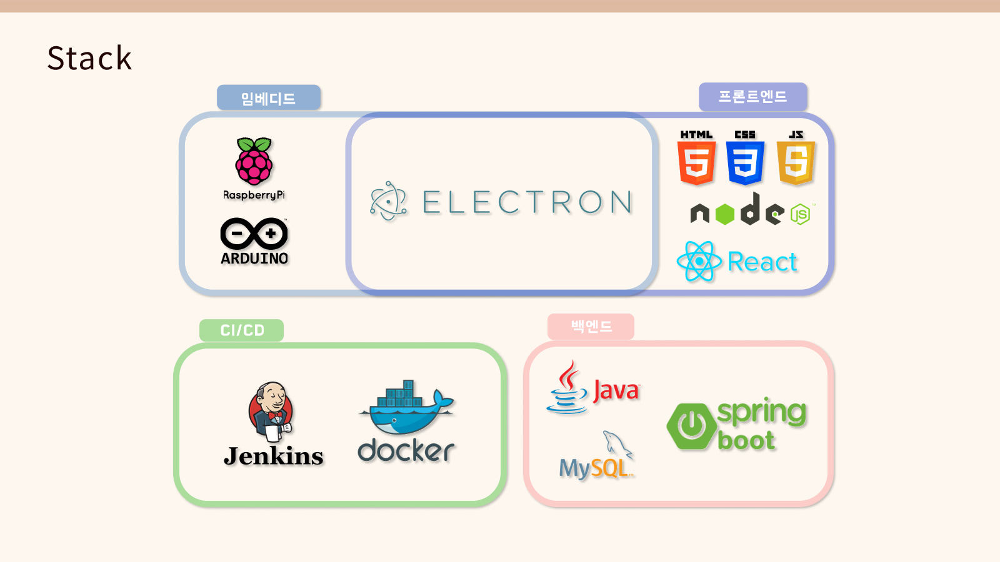

<br>

### 서버 아키텍쳐
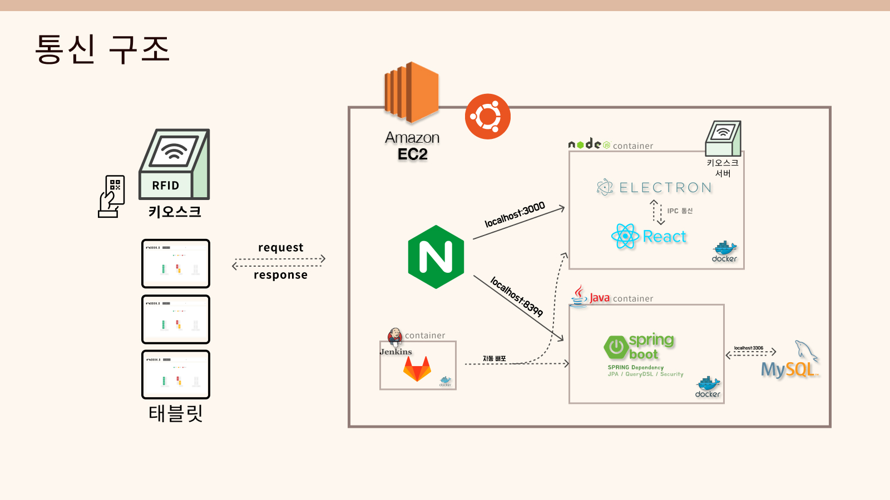


<br>


# 📁 프로젝트 파일 구조
## BackEnd
```
ddokdi
  ├── api
  ├── configuration
  ├── dto
  ├── entity
  ├── enums
  ├── exception
  ├── filter
  ├── interceptor
  ├── repository
  ├── service
  └── util

```

<br>


## FrontEnd

```
ddokdi
  ├── kiosk
  │   ├── public
  │   └── src
  │       └── kiosk
  │           ├── assets
  │           ├── components
  │           │   ├── Home
  │           │   ├── LogoToHome
  │           │   ├── SeatSet
  │           │   └── UserSet
  │           └── routes
  └── tablet
      ├── node_modules
      ├── public
      └── src
          └── tablet
              ├── assets
              ├── components
              │   └── viewStatus
              └── routes

```

<br>


# 🔊 협업 환경

## 🔊 협업 환경
- GitLab
  - Git-flow 전략으로 브랜치를 관리

  - 매주 금요일, 각 기능 브랜치를 develop으로 통합
- JIRA
  - 매주 월요일, 일주일 간 업무를 계획 후 Sprint
  - 주당 Story Point 40 이상으로 업무 계획

- Scrum
  - 매일 일과 시작전, 전날 업무 수행 결과와 당일 업무 계획 발표
  - Scrum 내용을 MatterMost에 기록

<br>


# 💡 역할 분배

## 권경민
- Embedded
- 팀장
- Raspberrypi
- 3D print
- UCC

<br>

## 이용욱
- Embedded
- RFID
- Arduino

<br>

## 배윤호
- Frontend
- Tablet
- UI/UX 설계
- UCC


<br>

## 호인영
- Frontend
- Kiosk
- UI/UX 설계


<br>

## 신희재
- Backend
- DB 설계
- API 설계 및 관리
- AWS EC2 및 CI/CD 관리


<br>

## 김병수
- Backend
- DB 설계
- API 설계 및 관리
- AWS EC2 및 CI/CD 관리

<br>

# 🔍 프로젝트 산출물

<br>

## 📱 서비스 화면

### 회원가입
- 좌석을 클릭하면 카드 태깅, 로그인, 회원 가입 중 하나를 요구합니다.
- 아이디는 이메일 양식을 따릅니다.
- 동일한 아이디는 사용할 수 없습니다.
- 동일한 아이디, 비밀번호 확인 불일치 시 팝업 알림이 뜹니다.

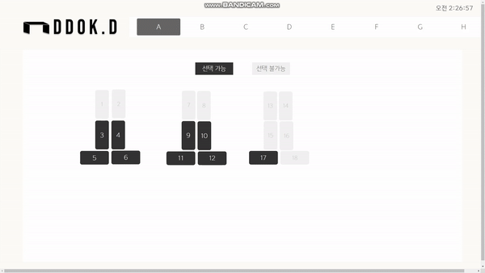

<br>

### 로그인
- 로그인에 성공하면 클릭했던 좌석이 배정됩니다.
- 로그인 완료 즉시 해당 좌석은 사용자의 기본 설정으로 세팅됩니다.
- 로그인 완료 시에 나온 4자리 숫자를 해당 좌석에 가서 입력하면 좌석 사용이 가능합니다.

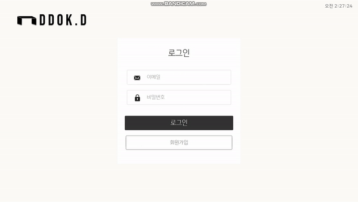

<br>


### 관리자 로그인
- 관리자 아이디로 로그인하면 자리가 배정되지 않고 관리자 페이지에 진입합니다.

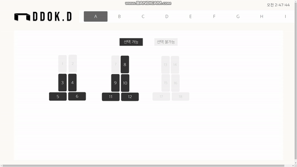

<br>


### 사용자 관리
- 관리자는 사용자 목록을 조회하고 상세 정보를 수정하며 삭제할 수 있습니다.

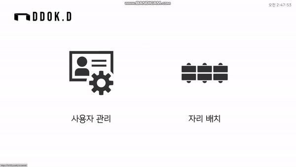

<br>


### 구역 관리
- 구역을 추가, 삭제할 수 있습니다.

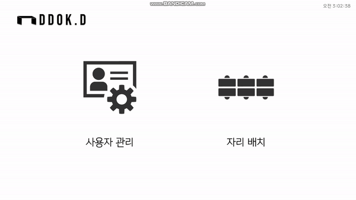

<br>


### 좌석 관리
- 좌석을 추가해서 원하는 위치로 이동시키고 회전시킬 수 있습니다.
- 휴지통에 드래그 앤 드롭하면 좌석을 삭제할 수 있습니다. 
- 설정한 좌석 배치를 저장할 수 있고 초기화하면 가장 최근 저장된 좌석 배치를 불러온다.

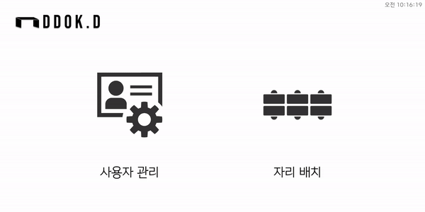

<br>


### 태블릿 로그인
- 키오스크에서 자리 배정 후 받은 4자리 숫자를 해당 좌석 태블릿에 입력하여 태블릿에 로그인할 수 있다.

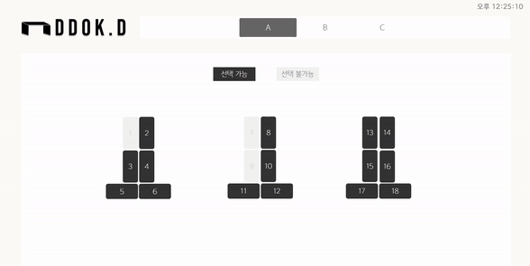

<br>


### 정보 수정
- 이름, 키, 핸드폰번호만 수정가능하고 이메일, 직급은 수정 불가하다.

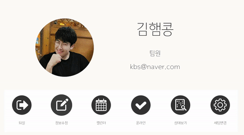

<br>


### 상태 설정 및 좌석 조회
- 온라인, 방해금지, 자리비움 3가지 상태를 설정할 수 있다.
- 다른 자리에 앉은 사람의 이름과 직급을 표시하고 색깔로 상태를 구분한다.

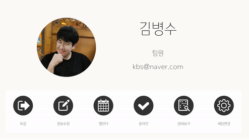

<br>

### 세팅 변경
- 책상과 모니터의 높낮이를 조절할 수 있다.
- 세팅 정보를 저장하고 불러올 수 있다.

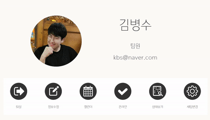

<br>

### 캘린더
- 캘린더에서 일정을 추가하고 한눈에 확인할 수 있습니다.
- 색의 진하기를 통해 일정의 중요도를 쉽게 파악할 수 있습니다.
- 시작시간, 종료시간을 설정할 수 있고 알림시간을 설정하여 시작시간 N분 전에 알림을 받을 수 있습니다.

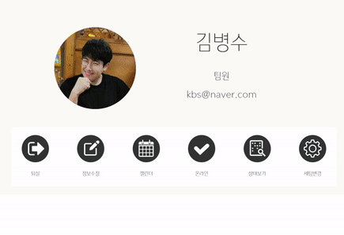

<br>


